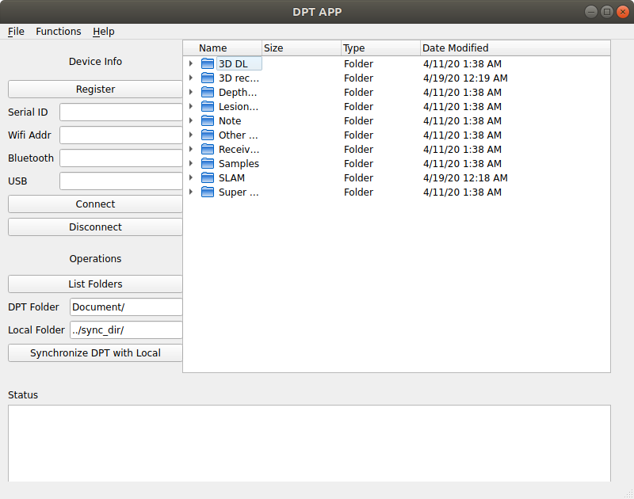
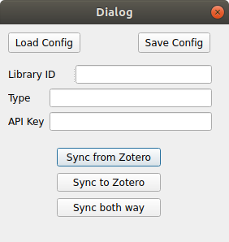

# Introduction

A simple GUI to interface with Sony Digital Paper. Allow users to synchronize the Digital Paper with their local folders. Provides function to synchronize files with Zotero.

### Functions

* Interface with Sony Digital Paper:
    * Register device
    * Connect device
    * Show list of folders in DPT

* Synchronize with Zotero:
    * Copy files from Zotero to local folders

# Installation

### Conda environment
* conda-forge

### Dependencies

* [dpt-rp1-py](https://github.com/janten/dpt-rp1-py)
* [Pyzotero](https://github.com/urschrei/pyzotero)
* pyqt

### One-line installation

```
conda create --name dpt  -c conda-forge  pyzotero pyqt
```

```
pip install dpt-rp1-py
```

# Usage

```
python dptAPP.y path_to_the_folder_to_synchronize
```


* Fill in the example configuration of device, and load it into the main window


* Fill in the example configuration of zotero account, and load it into the dialog


# ToDo & Issues

- [x] Connect digital paper in MainWindow
- [x] Test command of button in GUI to interface digital paper
- [x] Load/Save config of device
- [x] Load/Save config of zotero account
- [ ] Show/change folder to sync in zotero dialog
- [ ] Sync with zotero and remove gohst files in local folder
- [ ] Allow user to select specific folder to synchronize with Zotero
- [ ] Test Synchronization with user's personal library in Zotero
- [ ] Recursive synchronization in Zotero, currently just support two layers of folders
- [ ] Show status message in text browser to show information in GUI (MainWindow and ZoteroDialog)
- [ ] Add usage in README
- [ ] Add help dialog in GUI
- [ ] Adjust window in GUI
